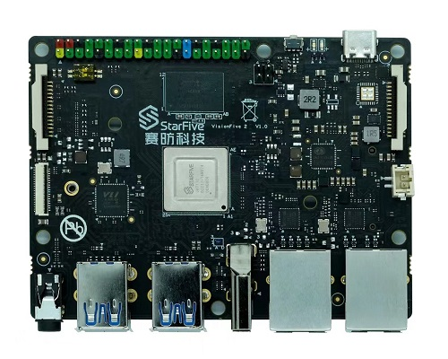

Required Hardware
=================
Make sure you have prepared the following hardware items:

• VisionFive 2

• Micro-SD card (32 GB or more)

• Micro-SD card reader

• PC with Linux/windows

• USB to Serial Converter (FT232RL)

• Power adapter(5V 3A)

• USB Type-C cable

